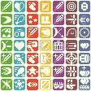

# Game Design Doc: Raccoon Zelda Game

## Name Ideas

- The Legend of Raccoon
- Dipc
- The Suburban Fantasy
- The Legend of Dipc
im not sure which one to use, im not satisfied with any of them.
maybe Dipc can be the legend?

## Synopsis

- After butting in and getting in the gas station line first, the person behind the Player who runs a secret magic cult zaps them with a tiny bit of magic.

- After the Player gets home, they suddenly start to turn into a raccoon, rush out of the door and into the woods where they fall unconsious on a rock.

- The player wakes up, finds that they are turned into a raccoon, and needs to turn themselves back somehow.

- Throughout the course of the game, the player discovers a secret magic cult that is turning pesky people into animals and expensive inanimate objects to be sold for more wealth.

[todo2]: # (make the legend)

- The Player uncovers a deliberatley vague tale of the Legend of Dipc throughout that can be interpreted by many people in different ways.

- The player discovers various weird events, some are trippy, some are freightening, and some are funny.

- The player discovers secret areas that further the lore. Some are incredibly hard to get to and will require either datamining, luck, or knowledge about other games.

- The player discovers underground dungeons that have loot.

- The player discovers various animal villages relating to the area that allow you to rest, get hints on nearby secrets, and buy things from a shop.

- The player enters houses depending on schedules of people and gets upgradable loot.

- The player discovers seemingly empty houses that contain a dungeon in the basement, where they fight one of 7 cult leaders, get one or more key items, and is taught how to use them throughout the dungeon.

- The player bounces between 4 main areas: neighborhood, town, magic forest, forest

- The player uses key items in creative ways in order to access secret areas that contain loads of money, food, or collectables.

- The player has their own house they can customize with collectables.

- The player gets all 7 keys to the 8th house, and enters gigantic and difficult dungeon that uses many items, contains difficult enemies that gradually goes deeper and deeper to the final boss, the cult leader, near the entrance to the underground where large demons are wanting to get out.

- The player defeats the final boss, the cult leader, and the game is finished.

- (normal ending) A cutscene that plays that shows the cult leader being banished to hell, along with their cult followers. You walk back to your home unchanged and rest.

- (good ending) A cutscene that plays that shows the cult leader turning people back into their normal selves across the town, the police arrest him, and the player doesnt turn back into a raccoon, which he is glad to see, and walks off to another town. It will also give you a new title screen, and the ability to play the game again (new game +) with more tougher enemies, boss fights and more.

- Beating new game + will give you another title screen, the good ending, and a very large and special collectable.

- 100%-ing the game, including finding every secret, results in a very special title screen.

# Top-layer specifications

## Game feel

- controls are tight and snappy, movements and animations have little or exaggerated wind-up time. Animations give player a sometimes unsure, sometimes confident demeanor. Think of wincing while swinging a sword.

- Animations visually pop, with exaggerated actions for better visual reading to the player.
  - Examples: Kirby, Mario, Zelda

## Visual Style

- Pixel-art

- limited color pallete

- limited color characters and tiles (at most 5, preferably 3)

- Tileset graphics

- 16x16 pixel tiles

- Player and standard width is around 16px wide.

- Colorful and vibrant, yet still grounded in reality.

## Sound style

- rhythmic
- serene
- use of synth instruments and pads, while incorporating real-sounding percussion and drums. NES-sound sprinkles here and there are welcome.
- use of a wurli electric piano
- vulf compressor

## Demo Progression

- Only past the first dungeon
- Limited area of Overworld

1. Intro
2. title screen
3. Overworld
4. Animal village, find dungeon 1, find items, find secrets, explore a couple houses.
5. Beat Dungeon 1
6. "Done with demo" message, support on kickstarter

## Technical

- Engine: GameMaker 2 (Or should we Use Unity??? Gosh idk)
- Platforms: Windows, Linux, Mac, Steam
- Future platforms: Switch, PS

# Controls

- Can be remapped in the title screen or the pause screen.
- Default Keyboard Keys:
  - Z
  - X
  - C
  - Space
  - E
  - Enter
  - Esc
  - Arrow Keys
  - A
  - S
  - Shift

- Default Controller (Nintendo Layout) Keys
  - A
  - B
  - X
  - Y
  - L (Shoulder)
  - R (Shoulder)
  - ZL
  - ZR
  - Start
  - Select
  - D-Pad

## Player Controls

### Player/UI Controls

Allow the player to use these at any time they have control

| Key | Button  | Action                                |
|---- |---------|---------------------------------------|
| E   | Start   | Open Inventory                        |
| Esc | Select  | Pause Game                            |
| A   | L       | Decrement Selected Item Category      |
| S   | R       | Increment Selected Item Category      |
| D   | ZL      | Toggle betwen Key and Consumable Items|

### Default Movement

This is when the player is idle, or is running

| Key        | Button  | Action                      |
|------------|---------|-----------------------------|
| Arrow keys | D-Pad   | Run                         |
| Z          | A       | Interact, Swing sword, Grab |
| X          | B       | Use Item                    |
| C          | X       | Use Key Item                |
| Space      | Y       | Jump                        |
| Shift      | ZR      | Shield                      |
| Crtl       | ZL      | Boomerang                   |

### Shielding Movement

This is when the player is holding a shield

| Key             | Button       | Action           |
|-----------------|--------------|------------------|
| Arrow keys      | D-Pad        | Strafe           |
| Z               | A            | Swing Sword      |
| X               | B            | Nothing          |
| C               | X            | Nothing          |
| Space           | Y            | Jump (w/ Shield) |
| Shift (release) | ZR (release) | Put away shield  |
| Ctrl            | ZL           | Nothing          |

### Jumping Movement

This is when the player is jumping (not off a ledge)

| Key        | Button  | Action     |
|------------|---------|------------|
| Arrow keys | D-Pad   | Move       |
| Z          | A       | Jump Slash |
| X          | B       | Nothing    |
| C          | X       | Nothing    |
| Space      | Y       | Nothing    |
| Shift      | ZR      | Nothing    |
| Ctrl       | ZL      | Nothing    |

### Swimming Movement

This is when the player is swimming (must have [Flippers](#flippers))

| Key        | Button  | Action     |
|------------|---------|------------|
| Arrow keys | D-Pad   | Swim       |
| Z          | A       | Dive (must have [Snorkel](#snorkel))|
| X          | B       | Nothing    |
| C          | X       | Nothing    |
| Space      | Y       | Nothing    |
| Shift      | ZR      | Nothing    |
| Ctrl       | ZL      | Nothing    |

### Snorkeling Movement

This is when the player is deep underwater after using the [Snorkel](#snorkel)

| Key        | Button  | Action        |
|------------|---------|---------------|
| Arrow keys | D-Pad   | Swim on Floor |
| Z          | A       | Surface       |
| X          | B       | Nothing       |
| C          | X       | Nothing       |
| Space      | Y       | Nothing       |
| Shift      | ZR      | Nothing       |
| Ctrl       | ZL      | Nothing       |

### Grabbing Movement

This is when the player is grabbing something.

| Key      | Button   | Action         |
|----------|----------|----------------|
| Forward  | Forward  | Push           |
| Backward | Backward | Pull (or lift) |
| Sideways | Sideways | Nothing        |
| Z        | A        | Nothing        |
| X        | B        | Nothing        |
| C        | X        | Nothing        |
| Space    | Y        | Nothing        |
| Shift    | ZR       | Nothing        |
| Ctrl     | ZL       | Nothing        |

### Carrying Movement

This is when the player is carrying a [Liftable Object](#liftable-blocks) on their head.

| Key        | Button | Action        |
|------------|--------|---------------|
| Arrow keys | D-Pad  | Move          |
| Z          | A      | Rest on Floor |
| X          | B      | Nothing       |
| C          | X      | Nothing       |
| Space      | Y      | Nothing       |
| Shift      | ZR     | Nothing       |
| Ctrl       | ZL     | Nothing       |

### Ramming Movement

This is when the player is dashing by using the [Ramming Helmet](#ramming-helmet).

| Key        | Button | Action         |
|------------|--------|----------------|
| Arrow keys | D-Pad  | Nothing        |
| Z          | A      | Nothing        |
| X          | B      | Nothing        |
| C (release)| X      | Skid to a Stop |
| Space      | Y      | Nothing        |
| Shift      | ZR     | Nothing        |
| Ctrl       | ZL     | Nothing        |

### No Input Movement
[todo1]: # (Fill the rest of list of no-input movement)

This is when the player is either:
- Jumping off a ledge
- Stabbing, swinging or on the last triple-sword swing
- Falling into a pit or Drowning
- Lifting or resting a [Liftable Object](#liftable-blocks)
- Using the [Tape Measurer](#tape-measurer)
- Wind-up animation while using the [Ramming Helmet](#ramming-helmet)
- ...And more. See [todo1]

| Key        | Button  | Action     |
|------------|---------|------------|
| Arrow keys | D-Pad   | Nothing    |
| Z          | A       | Nothing    |
| X          | B       | Nothing    |
| C          | X       | Nothing    |
| Space      | Y       | Nothing    |
| Shift      | ZR      | Nothing    |
| Ctrl       | ZL      | Nothing    |

## UI Controls

| Key               | Button  | Action  |
|-------------------|---------|---------|
| Arrow keys        | D-Pad   | Move    |
| Z, Enter          | A, Start| Confirm |
| X, Backspace, Esc | B       | Back    |

# Player

The main vessel that the player controls: A Raccoon.

## Looks
Cute, but doesnt want to be cute.
Looks like he's trying his best all the time
Clumsy/awkward, but determined.
Colors: Dark Brown, brown, light brown.

## Movement

- 8 Directional movement
- 4 Directional sword attacks
- 3 Types of sword attacks
  - Stab: which goes in the direction the player is facing, then retracts back in a straight line.
  - Swing: which goes from diagonally left of the player's facing direction to diagonally right of the player.
  - Triple hit: the player makes 2 "Swings" going from left to right, and then right to left, and then finally stabs. The action can be stopped on any point by not hitting the sword button.
- Swim. (by using [Flippers](#flippers))

## Health
- Units: 1 Heart = 2 Health
- Start: 3 hearts = 6 Health
- Maximum: 16 hearts = 32 Health

If the player's health becomes 0, they die and are sent back to their last Save Point in the overworld.

# Inventory

This is the main way the player can hold onto items.

## Storage

- 16 Slots for Consumables
- 24 Slots for each Key item
- 4 Slots for the current [Sword](#swords), [Shield](#shields), [Armor](#armor), and [Boomerang](#boomerang).

# Obtainables

Things that are collected in some way from various locations.

## Money

Is used for purchasing items from [Shops](#shops)

- Can be found in groups of 5, 10, and 50. (Maybe more??)

Can also be given to animals at certain prices (very expensive) to get [Collectable Items](#collectable-items) for the [Player's House](#players-house) (NOT NECCESARY TO 100% THE GAME)

## Consumable Items
Items that deplete in the inventory after use with the Consumable Item Button.

### Bombs
Cause both the player and enemies to take damage in a wide area.

#### M80

- Like a regular bomb. Set, get back, and explode.
- Destroys Bombable Walls.
- Damage:

#### Bottle Rocket

- Shoots a star in a straight line that goes straight until hitting a wall or enemy, then settling down, then exploding.
- Damage:

#### Roman Candle

- Shoots multiple stars like a bottle rocket.
- Damage:

#### Molotov Cocktail

- Spreads out a fire for a total of 4 blocks and lingers, setting anything on fire.
- Throw direction is determined by player direction, and goes out 4 blocks to give player ample time to escape its range.
- Damage:

#### Poison Bomb

#### Stun Bomb

### Food
Recovers health upon consumption and depletes from inventory.
- Recovers up to max health, and no more.

| Name        | [Health](#health) Recovered |
--------------|------------------------------
Hot dog       | 5
Hamburger     | 6
Chips         | 3
Chicken       | 4
Cookie        | 3
Sludge Bottle | 6
Herbs         | 8
Dragon Fruit  | 10
Demon Apple   | 12 
Health Bottle | 16
Super Bottle  | 20
Soul          | 30

## Key Items

### Lighter 

Allows the player to create fires that burn bushes and other things.

### Enemy Cloak

Allows the player to not be detected by enemies while the key-item button is held (eg, enemies that might do a fuck ton of damage and will kill you).

### Ramming Helmet

Makes the player charge up and dash head-first.
- When holding the key-item button, the player will charge up shortly and then charge in the direction until the key-item button is released, which they will skidd to a stop. 
- This will be able to break [Dash Blocks](#dash-blocks) and hurt enemies by 1.5x the damage of the player's currently equipped sword.

### Ice Boots

Makes the player stomps the ground and create an ice block.
  - The ice block can be kicked like a Koopa shell and be used to hurt enemies, and bounce around.
  - The ice block melts when in contact in fire.

### RPG-Game

Makes the player initiate an RPG battle with the first enemy in range 3 tiles in the player's direction.
  - RPG Battle mechanics is detailed more in [RPG Mechanics](#rpg-mechanics)
- Allows the player to gain more money and the chance for cheap food.

### Flashlight

Shines light when the key-item button is held. 

### Magnet

Allows the attraction of metal objects, like the [Metal Block](#metal-block)
- When key-item button is held down, starts attraction. And on release, stops attraction.
- Range is 8 blocks.

### Wall Shield

Allows the player to create a solid wall to block projectiles (that can be destroyed when hitting a wall), and stop enemy movement.
- When the key-item button is pressed, the wall-sheild is created. 
- The key-item button is disabled unless near the wall-shield.
- Destroyed if:
  - The player exits a 15-tile radius of the wall-shield.
  - The player switches to a different item.
  - The player presses the key-item button again near the wall-shield.

### Magic Rod

Shoots a simple magic projectile.

### Super Magic Rod

Shoots a magic projectile that bounces up to 5 times.

### 3D Glasses

Allows the player to see hidden platforms. 
- When the key-item button is held, a 3D effect is placed over the screen and the platforms becomes visible and tangible.
- When the key-item button is released, the 3D effect is taken off the screen, and the platforms disappear and become intangible.

### Saxophone

Allows the player to travel to any completed dungeon.
- Also reveals secrets when used in saxophone regions.
- Some enemies are averse to the sound of a saxophone

### Umbrella

Allows the player to fall slower after jumping
- Extends the movement range that the player has while jumping, for example, jumping over longer gaps
- Does not work when jumping off ledges

### Tape Measurer

Allows the player to latch onto [Hook Blocks](#hook-blocks).
- After hooking, pulls the player towards the [Hook Block](#hook-blocks).
  - Ignores collision with floor-like attributes, like pits and water. \
- On key-item button pressed, creates tape measurer and extends for 8 blocks.

### Drone

Allows the player to pan the camera around, mostly for finding strange openings that contain secrets
- Highlights certain areas like saxophone regions, hidden bombable walls, burnable bushes, and more.
  - Will not highlight SOME areas for extra secrecy. Must be told earlier upon obtaining that these immune areas exist.
- On key-item button pressed, drone is spawned, lifts up, then can be controlled.
- On key-item button pressed while active, goes back to the player, drops down, and is then removed.

### Bomb Drone

Same functionality as the [Drone](#drone), except that it can also drop [M80](#m80)'s
- Will consume first-occuring M80 in player's inventory. If there are no M80's, then it does not drop an M80.

### Hover Feather

Allows the player to hover for a maximum of 5 seconds to cross very wide gaps.
- The player can only move, cannot do anything else.
- On key-item button press, lifts the player up to maximum jump-height and stays in the air for 5 seconds.

## Permanent Key Items

These are items that do not need to be selected before using. Once collected, they will remain in the player's moveset. Many do not add a new button for an action, but rather lets the player use or survive certain objects, like water or ledges.

### Jump Boots

Boots that allow the player to jump using Space/Y. Height is clearing over 1 tile.

### Super Jump Boots

Boots that allow the player to jump higher than the regular Jump boots. Height is clearing over 2 tiles.

### Flippers

Allows the player to survive in deep water and swim.

### Snorkel

Allows the player to dive underwater in specific diving spots.

### Climbing Gloves

Allows the player to climb rough walls.

### Wall Staples

Allows the player to climb any walls that have an upper platform
  - eg: no climbing up walls that lead to a ceiling

### Lifting Gloves

Allows the player to lift [Liftable Objects](#liftable-block)

## Collectable Items

## Mechanical Parts

## Swords

Changes the player's attack power and way of attacking

List of all swords:

| Name         | Type   | Damage | ID |
|--------------|--------|--------|----|
| Stick        | Stab   | 1      | 0  |
| Branch       | Swing  | 1      | 1  |
| Wooden Sword | Triple | 1      | 2  |
| Switchblade  | Stab   | 2      | 3  |
| Metal Bat    | Swing  | 2      | 4  |
| Knife        | Triple | 2      | 5  |
| Butterfly    | Stab   | 3      | 6  |
| Katana       | Swing  | 3      | 7  |
| Mystic Sword | Triple | 3      | 8  |
| Light Knife  | Stab   | 4      | 9  |
| Grass Blade  | Swing  | 4      | 10 |
| Demon Sword  | Triple | 4      | 11 |
 

## Shields

When used, protects the player from bullets and/or enemy attacks.
| Name         |Description| ID |
|--------------|-----------|----|
| Wooden       | Blocks Solid projectiles.
| Spirit       | Blocks Magic Projectiles.
| Pot Lid      | Reflects Solid Reflectable Projectiles.
| Demon        | Blocks and Reflects All Projectiles

## Armor

## Demon Pendants
- Used for [Demon Buffs](#demon-buffs)

## Demon Keys
Used to open the [Final Dungeon](#dungeon-8)
- Obtained by beating cult followers from [Dungeons](#dungeons) 1-7.

## Heart Containers
Increase [Health](#health) by 2. (= 1 Heart)
- Total Heart Containers throughout the game: 16-3 (you start off with 3) = 13
- 7 found after beating Dungeons
- 6 are found elsewhere in the world
- 6 + 7 + 3 = 16

## Keys
Opens doors within the current dungeon.

### Regular Key
A key that can only be used on one door before disapearing.

### Skeleton Key
A key that can open any door within the dungeon. Useful after you have gotten past much of the dungeon, so retrying is easier.

### Boss Key
A key that opens the Dungeon's [Boss-Key Door](#boss-key-door)

# Enemies

# Bosses

# Obstacles

## Doors

These are obstacles that block the players path at some point in its use.

### Clear-All-Enemies Doors
Closes when entering room, and only opens after all enemies are defeated.

### One-Way Door
Doors that can only be traversed in one way, but not back.

### Key Door
A door that requires a key to open.

### Boss-Key Door
A door that requires the Boss Key to open.

### Button Door
A door that requires a [Button](#button) to be active.

### Switch Door
A door that is opened when a [Lever](#switch) is turned on.

### Dungeon Progression Doors
Stays open after becoming open, even after death. Useful for treks back to the boss fight after the player dies.

### Boss Door
Opens after defeating the boss.

### Mini-Boss Door
Opens after defeating the mini-boss.

# Puzzle Elements

## Liftable Blocks
Can be lifted and placed somewhere else.

## Dash Blocks
Can only be destroyed by dashing with the [Ram Helmet](#ramming-helmet).
## Dark Blocks
Can only be destroyed when in contact with light. Typically with the [Flashlight](#flashlight).

## Light Block
Shines a light in 1, 2, 3, or 4 directions. 
- Is a [Liftable Block](#liftable-blocks).

## Void Blocks
Like a [Dark Block](#dark-blocks), but it can only be destroyed when in contact with 2 light sources.

## Metal Block
Can be attracted to by the [Magnet](#magnet).

## One-Way Panels
Can only be passed through in one direction.

## Steep Ledges
Ledges that are taller than either the jump height while wearing the [Jump Boots](#jump-boots) or the [Super Jump Boots](#super-jump-boots). (depending on the progression of the dungeons.)
- Acts as a One-Way.

## Hook Blocks
Allows the player to latch onto with the [Tape Measurer](#tape-measurer).

## Button
Opens or turns on other things. 
- Can either be pressed once to activate, or turn off if there is no weight on it. 
- Can be pressed by the Player, Enemies, and [Liftable Blocks](#liftable-blocks).
## Switch
Switches on or off at the discresion of the player. 
- Does not toggle on or off on its own.

# Areas

## Dungeons

Dungeons contain puzzles, challenges for the player to get through
Each dungeon is long and arduous, with a final boss fight at the end
2 Items are obtained within each dungeon.

### Dungeon 1

### Dungeon 2

### Dungeon 3

### Dungeon 4

### Dungeon 5

### Dungeon 6

### Dungeon 7

### Dungeon 8

### Dungeon 9?

### Cave Dungeon A

### Cave Dungeon B

### Cave Dungeon C

### Cave Dungeon D

### Cave Dungeon E

### Cave Dungeon F... and more.

## Houses

## Underground Caverns

# UI
This is the section for all the UIs in the game.

## Visual Style
Simple, but effective. As readable as possible, while also being pleasing to look at.

## Title Screen
This is the first screen the player sees, with the games title, "Press Start/Enter", and the player character.
### Title Screen Visuals

### Title Screen Mechanics
- The player character is able to be controlled on the "Press Start/Enter" prompt, allowing players to test the character controls before playing.
- Once Start/Enter is pressed, the "Press Start/Enter" prompt fades out, the player character is no longer able to be controlled, and a box with the selections grow in the middle.
- Once the selections grow all the way, control is turned to the selections.
- After a couple seconds (10) of inactivity, the box shrinks back, and the "Press Start/Enter" prompt shows again.
- After a couple seconds again of inactivity (20s), the intro cutscene plays. This can be undone by pressing any button and takes the player back to the title screen with the "Press Start/Enter" prompt.

### Start/Continue Game
If there is no save file upon loading the game, say "Start" else say "Continue"
Load the save file, overworld room, and put the player back at their last save point.
Show a screen that shows the Save Point's location, Time played, and a small screen shot of the surrounding area of the Save Point.

### Options Menu
Load [Options](#options) menu.

### Title Screen Delete Save
Show the prompt: "Are you sure you want to delete your save data? This cannot be undone!!"
- Confirmation input is not taken afterwards for about 2 seconds, then put the selection on "No" first. But the player can press the Cancel button at any time to go back.

### Quit
Prompt: "Are you sure you want to quit?"
- Player can immediately press confirmation button to quit the game instantly.

## Gameplay UI

### HUD
This is displayed at any time the player is in control of the player character.
It turns transparent any time the player goes near the HUD to allow the player to see whats behind it.
#### Health Bar
Shows the current [Health](#health) of the player in hearts. (1 heart = 2 health)

Location: Top left
- 8 hearts for 2 rows.

#### Money Count
Shows how much [Money](#money) the player currently has.
Location: Middle top right, next to [Selected Items](#selected-items)
- New money makes the Money Count increment (or decrement) once every frame until it reaches the new value.

#### Selected Items
Shows which items the player currently has equipped.
Location: Top right
- 2 boxes with item graphics in them
- White border around one of the two boxes shows which can be quickly changed by using L/R.   
  - Can switch between them with the ZL Button. 

#### Custom Prompt
- Top Right: 2 Boxes that show the current [Consumable Item](#consumable-items) selected, and the current [Key Item](#key-items) selected. 
- Top Left, underneath the Hearts: [Keys](#keys)
  - Only if in a dungeon, and respective to each dungeon.
  - Eg: if i get some keys from each dungeon, the corresponding keys to each dungeon only shows up when inside the respective dungeons.
  - Why? No sharing keys between dungeons.
- Bottom Left: Prompt for special controls
Prompts:

| When                            | Message (Keyboard)        | Message (Controller)      |
|---------------------------------|---------------------------|---------------------------|
| Using [Bomb Drone](#bomb-drone) | Z - Drop Bomb, X - Return | A - Drop Bomb, B - Return |
| Using [Drone](#drone)           | X - Return                | B - Return                |

### Shop UI

### Pause Screen

### Warp Screen

Shown after going into a [Drain Pipe](#drain-pipes)

Shows a simplified "transit map" of the overworld, showing each available drain pipe the player can select connecting to one another.
- The transit map looks like a dark-mode UK transit map
  - Big thick, straight lines connecting dots representing drain pipes.
  - Selected drain pipes have their paths highlighted, otherwise a darker color.

- The player can select any drain pipe, but can only get through if they are unclogged.
  - If it is clogged, it shows a short animation of the outside of the drain pipe and a small nudge of the clogged material, showing the player they cannot get through without unclogging it from the other side.

- Once one is selected, it displayed a confirmation (default: yes) to warp to the selected drain pipe.

- While selecting, the player can press the cancel button to cancel, a confirmation pops up (default: yes) to exit the menu and resume gameplay.

## Options

# Overworld

## Common Overworld Game Mechanic Objects

These are objects that are commonly used throughout the Overworld for the benefit and convenience of the player.

### Save Point
A Recycling Bin that can be interacted with. When interacted with, controls are disabled (including inventory and pausing), the player character jumps into the recycling bin, and a prompt pops up that asks the player if they want to save. Yes, save. No, do not save. 
After either option, the player character pops out of the recycle bin and control is handed back to the player.

### Health Refill Point
A Trash Bin that can be interacted with. When interacted with, controls are disabled (including inventory and pausing), the player character jumps into the recycling bin, health is fully restored, and the player character pops out of the trash bin and control is handed back to the player.

### Campfire
Allows the player to skip to various parts of the day. Found in animal villages, and various parts of the Overworld.

Must be set on fire to be activated and able to be interacted with. Once the player interacts with it while active, the player sits down and a prompt appears that asks the player when to wake up.

Possible Options:
- 3am (Post-Midnight)
- 6am (Sunrise)
- 9am (Morning)
- 12pm (Mid-day)
- 3pm (Afternoon)
- 6pm (Sunset)
- 9pm (Night)
- 12am (Midnight)

Once selected, the screen fades to black, the time is set to the correct time (in in game time values), and the campfire is deactivated.
- This does not affect time played.

The player character wakes up, gets up, and control is returned to the player.

## Overworld Regions

### Forest

### Neighborhood

### Cursed Woods

### City

## Overworld Points of Interest

### Animal Villages
These are refugees for the player to rest at. No enemies can approach the villages.

#### Shops

#### Campfire
See [Campfires](#campfire)

#### Animals

#### Animal Houses

### Player's House

#### Equipment Display
A wall shows the player all of the equipment they have collected but are not equipped.

- By interacting with one of these, it shows a prompt to switch current equipment with the new equipment (Default: yes) and then shows an animation of the player taking the equipment and placing their old equipment on the wall.
  - NOTE: this effect is only temporary while the room is still loaded. Once the player exits and re-enters, the wall will be re-sorted.
  - How this can be done is: have the equipment just change its image to the old equipment when the player stuffs the new one away.

#### Summoning Circle
The more [Demon Pendants](#demon-pendants) the player collects, the more access they have to [Demon Buffs](#demon-buffs). 

- The circle appears in the house after collecting 1 pendant. (Maybe some other way?? A special item?)
- When interacted with, a gigantic buff demon sticking his head from hell through the portal appears and allows the player to choose buffs.

### Drain Pipes
These allow the player to quickly traverse to other Drain Pipes throughout the world.

- By default, these are clogged up and can be interacted by the player, showing the player character pulling on the sticks, dead grass and junk clogging the drain pipe and unclogging it, allowing the player to enter them.

- When entering, a [Drain Pipe Selection Screen](#warp-screen) shows up, and allows the player to select one.

- The player can only traverse through unclogged drain pipes.
  - Once unclogged (doesnt need to be entered), the player can use the drain pipe from anywhere.

- After either choosing a new drain pipe to enter to, or backing out, it shows an animation of the player leaving the drain pipe they have selected (or the same one they entered.)

## Overworld Obstacles
### Ledges
These are things the player can jump down, and sometimes jump back up (if boots have enough height.)

### Saxophone Regions
These are hidden regions that respond to when used with the [Saxophone](#saxophone)

### Bombable Walls
These are walls that are destructable with bombs.

### Burnable Bushes
### Grass
### Pits

## Underwater
### Underwater Caves
### Seaweed
### 

# Demon Buffs
Allows the player to temporarily gain certain small helpful abilities and buffs by collecting [Demon Pendants](#demon-pendants).

Collecting new Pendants will give the player as many new buffs as they have collected pendants in total times 2 minus 1. These are distributed between which pendants you have already collected.

- For example, if you have collected pendants 1, 2, and 5, and you just grabbed pendant 6, then you have previously had 9 buffs to choose from: 3 each from pendants 1, 2, and 5. You now have 16. 4 each from pendants 1, 2, 5 and 6.

|1|2|3|4|5|6|7|
|-|-|-|-|-|-|-|
|-|-|-|-|-|-|-|
|-|-|-|-|-|-|-|
|-|-|-|-|-|-|-|
|X|X|-|-|X|-|-|
|X|X|-|-|X|-|-|
|X|X|-|-|X|-|-|

Once Pendant 6 is collected...

|1|2|3|4|5|6|7|
|-|-|-|-|-|-|-|
|-|-|-|-|-|-|-|
|-|-|-|-|-|-|-|
|!|!|-|-|!|!|-|
|X|X|-|-|X|!|-|
|X|X|-|-|X|!|-|
|X|X|-|-|X|!|-|

So your total buffs to choose from at any time is (pendants_collected)^2

## Buffs
 
Image                                                                                     | Buff Name |Description
----------------------------------------------------------------------------------------- |-----------|-----------
                               | Attack	  | Up's Attack Damage by 1
                               | Swing	    | Makes you able to Swing any weapon
                                                            | Vault	    | Sligtly longer hang time when jumping
                                                            | Swipe	    | Makes you able to Backhand with any weapon
                                                            | Triple Hit|	Makes you able to Triple swing with any weapon.
 | Regen     | Regenerate Health over time. (1 half every 20s)
                               | Fasting   |	Faster Consumption Time
                                                            | Teleport  | Jumping Allows Teleporting in a small radius
                                                            | Focus     | Melee Attacks auto-aim towards closest enemy.
                               | Speed     | Faster movement Speed
                              | Stun      | Melee Attacks Stun Enemies
                                                            | Astir     | Melee Attacks Are Faster
                                                            | Miss	    | Attacks by Enemies have a 10% chance to miss
                                                            | Moment    | Slows down game time.
 | Defense   | Decreases Damage taken by Enemies by 1
                                                            | Balance	  | No Knockback when hit.
                              | Punch	    | Higher Knockback to Enemies when using any Stab Weapon
                                                            | Resilient | Provides complete invulnerability to 5 projectiles
                               | Poison    |	Melee Attacks Poision Enemies.
                              | Flame     |	Melee Attacks Set Enemies on Fire Briefly.
                                                            | Reflect   | Melee Attacks Reflect Projectiles.
                                                            | Trap      | Melee Attacks Trap enemies for longer, allowing combos.
                                                            | Docile    | Enemies have a chance to stop targeting you if they are.
                               | Target    | Projectiles home in on enemies.
                              | Puncture  | Projectiles go through an enemy.
                                                            | Cloak     | Makes Enemies not notice you for 5 Seconds upon entering.
                                                            | Zip       | Projectiles travel faster.
                                                            | Distract  |	Enemies may start infighting.
                               | Loot      | Money drops are increased and reward more.
                                                            | Vacuum    | Hearts and Money go towards player.
                                                            | Orbiter   | Projectiles orbit around player
                              | Health    | Health drops are increased and reward more.
                                                            | Plunder   | Both Health drops and Money drops reward more.

# Save File
The save file is located in AppData.

## Format
GAME TITLE Checked along with number of lines in file to determine if the file is valid. (Could do a checksum?)

data1

data2

data3

data3.1

data3.2

data3.3

...

Some values only span one line, while lists of data can span multiple lines.

Valid Types:

- Number: any number

- Float: any decimal number

- Boolean: nothing (new line character) or space character.

- Special: Numbers that hold meaning (like an ID) 

  - "Nothing" value is an empty line (only the new line char)

It holds information about:

## Time Played
Type: Number
- Ticks Once per second while player has control.
- Formated as [hour]:[min]:[sec]

## Secrets Found
Type: Boolean List
- Every secret is assigned a boolean.

## Save Point
Type: Number
-  Each [Save Point](#save-point)

## Obtained Key Items
Type: Boolean List
- Each [Key Item](#key-items) is assigned a boolean.

## Unclogged Drain Pipes
Type: Boolean List
- Each [Drain Pipe](#drain-pipes) is assigned a boolean. (False = Clogged, True = Unclogged)

## Saved Inventory 
This holds all information about what the player currently has in their inventory, including what in each slot and how much.

### Type of Consumable Item In Inventory
Type 1: Special List
- Each Inventory Slot has an ID that shows what [Consumable Item](#consumable-items) is in that slot.

### Amount of Consumable Item In Inventory
Type 2: Number List
- Each Inventory Slot has the amount that is in that slot.

## Saved Equipment

### Current Sword
Type 1: Special
- Current Sword ID

### Current Shield
Type 2: Special
- Current Sheild ID

### Current Armor
Type 3: Armor
- Current Armor ID

## Configuration of House's Items
Type: Special List
- A list of the ID of each square tile for their collectables.
- If any values are not valid (eg 1 half of a couch, or inside of the summon circle), then do not show.

## Obtained Collectable items for House
Type: Boolean List
- Every Collectable is assigned a collected flag

## Obtained Swords
Type: Boolean List
- Every Sword is assigned a boolean.

## Obtained Shields
Type: Boolean List
- Every Shield is assigned a boolean.

## Obtained Armor
Type: Boolean List
- Every Armor is assigned a boolean.

## Obtained Demon Pendants
Type: Boolean List
- Every [Pendant](#demon-pendants) is assigned a boolean.

## Which Demon Keys Collected
Type: Boolean List
- Every [Demon Key](#demon-keys) is assigned a boolean.

## Dungeon Information

### Dungeon 1
### Dungeon 2
### Dungeon 3
### Dungeon 4
### Dungeon 5
### Dungeon 6
### Dungeon 7
### Dungeon 8

### Cave Dungeon A
### Cave Dungeon B
### Cave Dungeon C
### Cave Dungeon D
### Cave Dungeon E
### Cave Dungeon F

# Day/Night System

