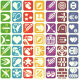
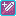

# Demon Buffs

Allows the player to temporarily gain certain small helpful abilities and buffs by collecting [Demon Pendants](obtainables.md#demon-pendants).

Collecting new Pendants will give the player as many new buffs as they have collected pendants in total times 2 minus 1. These are distributed between which pendants you have already collected.

- For example, if you have collected pendants 1, 2, and 5, and you just grabbed pendant 6, then you have previously had 9 buffs to choose from: 3 each from pendants 1, 2, and 5. You now have 16. 4 each from pendants 1, 2, 5 and 6.

|1|2|3|4|5|6|7|
|-|-|-|-|-|-|-|
|-|-|-|-|-|-|-|
|-|-|-|-|-|-|-|
|-|-|-|-|-|-|-|
|X|X|-|-|X|-|-|
|X|X|-|-|X|-|-|
|X|X|-|-|X|-|-|

Once Pendant 6 is collected...

|1|2|3|4|5|6|7|
|-|-|-|-|-|-|-|
|-|-|-|-|-|-|-|
|-|-|-|-|-|-|-|
|!|!|-|-|!|!|-|
|X|X|-|-|X|!|-|
|X|X|-|-|X|!|-|
|X|X|-|-|X|!|-|

So your total buffs to choose from at any time is (pendants_collected)^2

## Buffs

TODO: Single images are outdated and need to be replaced.

|Image                                                                                     | Buff Name |Description|
|----------------------------------------------------------------------------------------- |-----------|-----------|
|                      | Attack    | Up's Attack Damage by 1|
|                                   | Swing     | Makes you able to Swing any weapon|
|                                                            | Phase     | Attack enemies through walls|
|                                                            | Swipe     | Makes you able to Backhand with any weapon|
|                                                            | Triple Hit| Makes you able to Triple swing with any weapon.|
| | Regen     | Regenerate Health over time. (1 half every 20s)|
|                               | Fasting   | Faster Consumption Time|
|                                                            | BackAttack  | Back attacking enemies do more damage|
|                                                            | Focus     | Melee Attacks auto-aim towards closest enemy.|
|                               | Speed     | Faster movement Speed|
|                              | Stun      | Melee Attacks Stun Enemies|
|                                                            | Astir     | Melee Attacks Are Faster|
|                                                            | Miss     | Attacks by Enemies have a 10% chance to miss|
|                                                            | Cut    | Destroy projectiles with any attack.|
| | Defense   | Decreases Damage taken by Enemies by 1|
|                                                            | Balance   | No Knockback when hit.|
|                              | Punch     | Higher Knockback to Enemies when using any Stab Weapon|
|                                                            | Resilient | Provides complete invulnerability to 5 projectiles|
|                               | Poison    | Melee Attacks Poision Enemies.|
|                              | Flame     | Melee Attacks Set Enemies on Fire Briefly.|
|                                                            | Reflect   | Melee Attacks Reflect Projectiles.|
|                                                            | Trap      | Melee Attacks Trap enemies for longer, allowing combos.|
|                                                            | Docile    | Enemies have a chance to stop targeting you if they are.|
|                               | Target    | Projectiles home in on enemies.|
|                              | Puncture  | Projectiles go through an enemy.|
|                                                            | Cloak     | Makes Enemies not notice you for 5 Seconds upon entering.|
|                                                            | Zip       | Projectiles travel faster.|
|                                                            | Vision  | Highlights enemies, even if they are hidden.|
|                               | Loot      | Money drops are increased and reward more.|
|                                                            | Vacuum    | Hearts and Money go towards player.|
|                                                            | ~~Orbiter~~   | ~~Projectiles orbit around player~~|
|                              | Health    | Health drops are increased and reward more.|
|                                                            | Plunder   | Both Health drops and Money drops reward more.|

## Buff Demon

A demon in your [House](/overworld.md#players-house) that can be summoned in order to select buffs.

You summon him after collecting 5 [TP](/obtainables.md#toilet-paper).

- A mystical aura appears around the pentagram of 5 rolls, if you interact with it, a portal opens up in the floor and a demon reaches out his hands and climbs up.
- Interacting with him opens the menu for selecting demon buffs by paying with [TP](/obtainables.md#toilet-paper)

### Selecting Buffs

Applying a buff costs 1 [TP](/obtainables.md#toilet-paper).
Up to 3 buffs may be applied at the same time, with some conditions for what buffs can be simultaneously applied.

1. If a tier buff is selected after already choosing another buff in that tier, it replaces the first one.
2. If a buff is chosen that is incompatible with a previous buff, then the buff chosen replaces the previous buff.
  a. A marker appears next to the buff while selecting it signaling that its incompatible. (Along with another marker showing what its incompatible with.)

Along with this, the player cannot select the same buff 2 or 3 times. (option is greyed out)

Thus, since both replace previously selected buffs, its best to have a single incompatible set of buffs to look through and figure out if its incompatible.
