# Obtainables

Things that are collected in some way from various locations.

## Chests

These are things that can be interacted with in order to obtain [Obtainables](#obtainables)

## Money

Is used for purchasing items from [Shops](overworld.md#shops)

- Can be found in groups of 5, 10, and 50. (Maybe more??)

Can also be given to animals at certain prices (very expensive) to get [Collectable Items](#collectable-items) for the [Player's House](overworld.md#players-house) (NOT NECCESARY TO 100% THE GAME)

## Consumable Items

Items that deplete in the inventory after use with the Consumable Item Button.

### Bombs

Cause both the player and enemies to take damage in a wide area.

#### M80

- Like a regular bomb. Set, get back, and explode.
- Destroys Bombable Walls.
- Damage:

#### Bottle Rocket

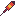

- Shoots a star in a straight line that goes straight until hitting a wall or enemy, then settling down, then exploding.
- Damage:

#### Roman Candle

- Shoots multiple stars like a bottle rocket.
- Damage:

#### Molotov Cocktail

- Spreads out a fire for a total of 4 blocks and lingers, setting anything on fire.
- Throw direction is determined by player direction, and goes out 4 blocks to give player ample time to escape its range.
- Damage:

#### Poison Bomb

#### Stun Bomb

### Food

Recovers health upon consumption and depletes from inventory.

- Recovers up to max health, and no more.

| Name        | [Health](player.md#health) Recovered |
|--------------|------------------------------|
|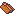Hot dog       | 5|
|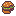Hamburger     | 6|
|Chips         | 3|
|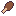Chicken       | 4|
|Cookie        | 3|
|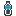Sludge Bottle | 6|
|Herbs         | 8|
|Dragon Fruit  | 10|
|Demon Apple   | 12|
|Health Bottle | 16|
|Super Bottle  | 20|
|Soul          | 30|

## Key Items

### Lighter

Allows the player to create fires that burn bushes and other things.

### Enemy Cloak

Allows the player to not be detected by enemies while the key-item button is held (eg, enemies that might do a fuck ton of damage and will kill you).

### Ramming Helmet

Makes the player charge up and dash head-first.

- When holding the key-item button, the player will charge up shortly and then charge in the direction until the key-item button is released, which they will skidd to a stop.
- This will be able to break [Dash Blocks](puzzle-elements.md#dash-blocks) and hurt enemies by 1.5x the damage of the player's currently equipped sword.

### Ice Boots

Makes the player stomps the ground and create an ice block.

- The ice block can be kicked like a Koopa shell and be used to hurt enemies, and bounce around.
- The ice block melts when in contact in fire.

### RPG-Game

Makes the player initiate an RPG battle with the first enemy in range 3 tiles in the player's direction.

- RPG Battle mechanics is detailed more in [RPG Mechanics](rpg-mechanics.md)
- Allows the player to gain more money and the chance for cheap food.

### Flashlight

Shines light when the key-item button is held.

### Magnet

Allows the attraction of metal objects, like the [Metal Block](puzzle-elements.md#metal-block)

- When key-item button is held down, starts attraction. And on release, stops attraction.
- Range is 8 blocks.

### Wall Shield

Allows the player to create up to 3 solid walls to reflect projectiles and stop enemy movement.

Puzzles can be made where the player must set up walls to reflect a projectile and hit a switch or something.

- When the key-item button is pressed, the wall-sheild is created.
- The key-item button is disabled unless near the wall-shield.
- Destroyed if:
  - The player exits a 15-tile radius of the wall-shield.
  - The player switches to a different item.
  - The player presses the key-item button again near the wall-shield.

### Magic Rod

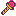

Shoots a simple magic projectile.

### Super Magic Rod

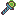

Shoots a magic projectile that bounces up to 5 times.

### 3D Glasses

Allows the player to see hidden platforms.

- When the key-item button is held, a 3D effect is placed over the screen and the platforms becomes visible and tangible.
- When the key-item button is released, the 3D effect is taken off the screen, and the platforms disappear and become intangible.

### Saxophone

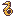

Allows the player to travel to any completed dungeon.

- Also reveals secrets when used in saxophone regions.
- Some enemies are averse to the sound of a saxophone

### Umbrella

Allows the player to fall slower after jumping

- Extends the movement range that the player has while jumping, for example, jumping over longer gaps
- Does not work when jumping off ledges
- Keeps direction when jumping. Cannot change direction, only move forwards.

### Tape Measurer

Allows the player to latch onto [Hook Blocks](puzzle-elements.md#hook-blocks).

- After hooking, pulls the player towards the [Hook Block](puzzle-elements.md#hook-blocks).
  - Ignores collision with floor-like attributes, like pits and water. \
- On key-item button pressed, creates tape measurer and extends for 8 blocks.

### Drone

Allows the player to pan the camera around, mostly for finding strange openings that contain secrets

- Highlights certain areas like saxophone regions, hidden bombable walls, burnable bushes, and more.
  - Will not highlight SOME areas for extra secrecy. Must be told earlier upon obtaining that these immune areas exist.
- On key-item button pressed, drone is spawned, lifts up, then can be controlled.
- On key-item button pressed while active, goes back to the player, drops down, and is then removed.

### Bomb Drone

Same functionality as the [Drone](#drone), except that it can also drop [M80](#m80)'s

- Will consume first-occuring M80 in player's inventory. If there are no M80's, then it does not drop an M80.

### Hover Feather

Allows the player to hover for a maximum of 5 seconds to cross very wide gaps.

- The player can only move, cannot do anything else.
- On key-item button press, lifts the player up to maximum jump-height and stays in the air for 5 seconds.
- CAN change direction, more useful than the [Umbrella](#umbrella)umbrella because the player can use the hover to weave between gaps.

## Permanent Key Items

These are items that do not need to be selected before using. Once collected, they will remain in the player's moveset. Many do not add a new button for an action, but rather lets the player use or survive certain objects, like water or ledges.

### Jump Boots

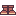

Boots that allow the player to jump using Space/Y. Height is clearing over 1 tile.

### Super Jump Boots

Boots that allow the player to jump higher than the regular Jump boots. Height is clearing over 2 tiles.

### Flippers

Allows the player to survive in deep water and swim.

### Snorkel

Allows the player to dive underwater in specific diving spots.

### Climbing Gloves

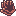

Allows the player to climb rough walls.

### Wall Staples

Allows the player to climb any walls that have an upper platform

- eg: no climbing up walls that lead to a ceiling

### Lifting Gloves

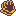

Allows the player to lift [Liftable Objects](puzzle-elements.md#liftable-blocks)

## Collectable Items

## Mechanical Parts

## Swords

Changes the player's attack power and way of attacking

List of all swords:

| Name         | Type   | Damage | ID |
|--------------|--------|--------|----|
| None         | Stab   | N/A    | -1 |
| Stick        | Stab   | 1      | 0  |
| Branch       | Swing  | 1      | 1  |
| Wooden Sword | Triple | 1      | 2  |
| Switchblade  | Stab   | 2      | 3  |
| Metal Bat    | Swing  | 2      | 4  |
| Knife        | Triple | 2      | 5  |
| Butterfly    | Stab   | 3      | 6  |
| Katana       | Swing  | 3      | 7  |
| Mystic Sword | Triple | 3      | 8  |
| Light Knife  | Stab   | 4      | 9  |
| Grass Blade  | Swing  | 4      | 10 |
| Demon Sword  | Triple | 4      | 11 |

## Shields

When used, protects the player from bullets and/or enemy attacks.

| Name         |Description| ID |
|--------------|-----------|----|
| Wooden       | Blocks Solid projectiles.|0|
| Spirit       | Blocks Magic Projectiles.|1|
| Pot Lid      | Reflects Solid Reflectable Projectiles.|2|
| Demon        | Blocks and Reflects All Projectiles|3|

## Armor

## Demon Pendants

- Used for [Demon Buffs](demon-buffs.md)

## Demon Keys

Used to open the [Final Dungeon](areas.md#dungeon-8)

- Obtained by beating cult followers from [Dungeons](areas.md#dungeons) 1-7.

## Toilet Paper

- Used for paying for [Demon Buffs](demon-buffs.md) found in houses.

## Heart Containers

Increase [Health](player.md#health) by 2. (= 1 Heart)

- Total Heart Containers throughout the game: 16-3 (you start off with 3) = 13
- 7 found after beating Dungeons
- 6 are found elsewhere in the world
- 6 + 7 + 3 = 16

## Keys

Opens doors within the current dungeon.

### Regular Key

A key that can only be used on one door before disapearing.

### Skeleton Key

A key that can open any door within the dungeon. Useful after you have gotten past much of the dungeon, so retrying is easier.

### Boss Key

A key that opens the Dungeon's [Boss-Key Door](obstacles.md#boss-key-door)
