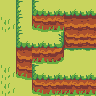
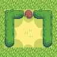
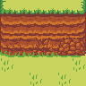
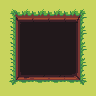

# Overworld

Large hub and challenge area for connecting every other room together.

- [Day-Night](day-night-system.md#daynight-system) happens most visually here, cause, you know, its outside.

- Themes
  - Nature
  - Urban
  - Lived-In
  - Comedic parody for man-made things
  - Earnest imitation for natural things

## Common Overworld Game Mechanic Objects

These are objects that are commonly used throughout the Overworld for the benefit and convenience of the player.

### Save Point

A Recycling Bin that can be interacted with.

When interacted with, controls are disabled (including inventory and pausing), the player character jumps into the recycling bin, and a prompt pops up that asks the player if they want to save. Yes, save. No, do not save.

After either option, the player character pops out of the recycle bin and control is handed back to the player.

### Health Refill Point

A Trash Bin that can be interacted with.

When interacted with, controls are disabled (including inventory and pausing), the player character jumps into the recycling bin, health is fully restored, and the player character pops out of the trash bin and control is handed back to the player.

### Campfire

Allows the player to skip to various parts of the day. Found in animal villages, and various parts of the Overworld.

Must be set on fire to be activated and able to be interacted with. Once the player interacts with it while active, the player sits down and a prompt appears that asks the player when to wake up.

| Name     | Time | [IGT](day-night-system.md#in-game-time) |
|----------|------|----------------------|
| Midnight | 12am | 0s                   |
| Sunrise  | 6am  | 360s                 |
| Noon     | 12pm | 720s                 |
| Sunset   | 6pm  | 1080s                |

Once selected, the screen fades to black, the time is set to the correct time (in in game time values), and the campfire is deactivated.

- Skipping through the day does not affect time played.

The player character wakes up, gets up, and control is returned to the player.

## Overworld Regions

4 quadrants of the Overworld that contain [POIs](#overworld-points-of-interest) for the player to find.

- Custom Day/Night music for each region
- Doesn't have to *all* be themed for each quadrant, can be plains or hills or some more forest mixed in.
  - They are more of a mental-box organization of areas that can be categorized.
- Divided by uncrossable 60 mph roads.
  - Going on the road instantly kills the player by getting run over.
  - Surrounded by zombie flat raccoons to warn player.
  - Traversed by transitory caves or swimming underneath via rivers.

### Waterfront

- Lake-houses
- A big lake
- Rivers
- Swamps
- Underwater
  - Grottos
- Water-related enemies

#### Waterfront Animal Village

- Mudskippers
- Underwater society

### Fields

- Farmland
- Corn maze
- Farmhouses
- Barns
- Stables

#### Fields Animal Village

- Barn animals

### Urban

combination of neighborhood and small town

- High density, small houses
- Backyards
- Parks
- Alleyways
- Buildings
- Humans

#### Urban Animal Village

- Living objects
- Cursed humans to be objects

### Cursed Woods

Forest with an affliction of some kind

- Cabins
- Supernatural things
- Thick foliage
- Tough enemies

#### Cursed Animal Village

- Mushroom dudes
- Cursed animals to be mushrooms

### Forest

- Creeks
- Trees
- Uneven ground
- Regular Enemies

- More of a region that fills in the gaps for other regions, like a "plains" biome

#### Forest Animal Village

- Regular animals
- First animal village player encounters

## Overworld Points of Interest

Things that the player finds and may go back to.

### Stationary Markers

Stationary or slightly animated structures that serve as a location marker for many different other points.

- They may have

### Weird Things

These are strange looking features that contain an entrance that requires a certain item or thing to be completed.

### Animal Villages

These are refugees for the player to rest at. No enemies can approach the villages.

#### Shops

These contain consumable items that the player can buy, like bombs and food.

#### Campfires

See [Campfires](#campfire)

#### Animals

NPCs for the player to interact with. When interacted, they tell a picture story that gives a hint to a secret or mechanic within the game.

Hints

|Player Takeaway| Picture Story Synopsis| Animal|
|---------------|-----------------------|-------|
|Saxophone regions|Sings and reveals a staircase|Bird|
|Collect Toilet Paper| sees someone suspicious hoarding toilet paper| Beaver |
|How to read regular  | explains cave wall text font smush | |

#### Animal Houses

### Cursed Woods Village

These are similar to Animal Villages, but have little mushroom people (not toads!) as villagers.

### Caves

These contain challenges that the player can solve to obtain items.

#### Text Caves

Has text written on the wall that points the player to something or doing something.

3 levels:

1. Regular Text: sort of hard to read because there is no spacing between letters, but can make it out.
2. Inverted Text: uses the same font but inversed, so letters blend into the background and its harder to read.
3. Translated Text: uses Inverted Text to write something, but looks gibberish when read. Uses a translation method to decode.

#### Mini-Dungeon Caves

Mini-dungeons to beat, typically with a harder enemy at the end to serve as a boss. Around 5 minutes to complete.

#### Item Puzzle Caves

Requires a specific combination of items or a single item to be able to complete.

Also shows novel functionality of items

Maybe use those items in order to even enter them?

Ideas: Super magic wand

#### Transitory Caves

Caves that link two locations together in the Overworld.

### Player's House

This is the player's residency they can come back to at any time.

- A cave with two chambers, one for furniture and one for buffs.
- Music grows from the normal cave sounds to a more homey song
  - Grows via the progression of the game in terms of how much equipment the player has, and how full their furniture space is.
  - 4 stages: Barely Anything, Some Stuff, More Stuff, Pretty Full

#### Equipment Display

A wall shows the player all of the equipment they have collected but are not equipped.

- By interacting with one of these, it shows a prompt to switch current equipment with the new equipment (Default: yes) and then shows an animation of the player taking the equipment and placing their old equipment on the wall.
  - NOTE: this effect is only temporary while the room is still loaded. Once the player exits and re-enters, the wall will be re-sorted.
  - How this can be done is: have the equipment just change its image to the old equipment when the player stuffs the new one away.

#### Summoning Circle

The more [Demon Pendants](obtainables.md#demon-pendants) the player collects, the more access they have to [Demon Buffs](demon-buffs.md).

- The circle appears in the house after collecting 1 pendant. (Maybe some other way?? A special item?)
- When interacted with, a gigantic buff demon sticking his head from hell through the portal appears and shows the [Buff Selection Menu](ui.md#demon-buff-selector) to allow the player to choose buffs.

#### Furniture Space

A grid of spaces to place [Furniture](obtainables.md#furniture) and a chest that opens the  menu when interacted with.

- The chest does not appear until you have atleast 1 furniture item.
- Multiple of the same furniture item can be placed.

#### Dummy

A practice dummy to hit. Never dies.

### Drain Pipes

These allow the player to quickly traverse to other Drain Pipes throughout the world.

- By default, these are clogged up and can be interacted by the player, showing the player character pulling on the sticks, dead grass and junk clogging the drain pipe and unclogging it, allowing the player to enter them.

- When entering, a [Drain Pipe Selection Screen](ui.md#warp-screen) shows up, and allows the player to select one.

- The player can only traverse through unclogged drain pipes.
  - Once unclogged (doesnt need to be entered), the player can use the drain pipe from anywhere.

- After either choosing a new drain pipe to enter to, or backing out, it shows an animation of the player leaving the drain pipe they have selected (or the same one they entered.)

## Overworld Obstacles

### Ledges

These are things the player can jump down, and sometimes jump back up (if boots have enough height.)

### Saxophone Regions

These are hidden regions that respond to when used with the [Saxophone](obtainables.md#saxophone)

### Bombable Walls

These are hidden holes filled with rock that are destructable with bombs.

### Burnable Bushes

These are bushes that can be burned to find hidden entrances.

### Grass

While all grass is cuttable, some cuttable grass may contain hidden entrances.

### Pits

These are pits the player can fall into and take damage. They respawn at the place before they fell in.

## Underwater

### Underwater Caves

### Seaweed
