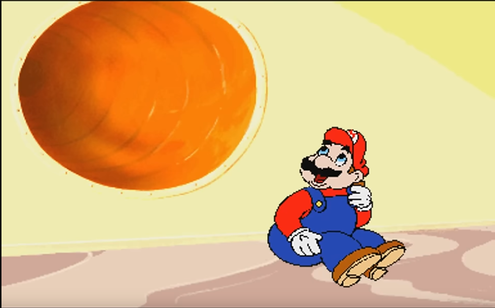

# Top-layer specifications

## Game feel

- controls are tight and snappy, movements and animations have little or exaggerated wind-up time. Animations give player a sometimes unsure, sometimes confident demeanor. Think of wincing while swinging a sword.

- Animations visually pop, with exaggerated actions for better visual reading to the player.
  - Examples: Kirby, Mario, Zelda

## Visual Style

- Pixel-art

- limited color pallete

- limited color characters and tiles (at most 5, preferably 3)

- Tileset graphics

- 16x16 pixel tiles (can be split up into 8x8 tiles but only for combining edge tiles.)

- Player and standard width is around 16px wide.

- Colorful and vibrant, yet still grounded in reality.

## Sound style

- rhythmic
- serene
- use of synth instruments and pads, while incorporating real-sounding percussion and drums. NES-sound sprinkles here and there are welcome.
- use of a wurli electric piano
- vulf compressor

## Demo Progression

- Only past the first dungeon
- Limited area of Overworld

1. Intro
2. title screen
3. Overworld
4. Animal village, find dungeon 1, find items, find secrets, explore a couple houses.
5. Beat Dungeon 1
6. "Done with demo" message, support on kickstarter

## Technical

- Engine: GameMaker 2 (Or should we Use Unity??? Gosh idk)
- Platforms: Windows, Linux, Mac, Steam
- Future platforms: Switch, PS

## Ease Of Use

### Difficulty

Difficulty for many things can be set by the player at any time in order to challenge/ take off challenge for themselves.

These toggles have to be:

- Accessible at moments where the player would *want* to set difficulty (eg: after they die or before a challenging part)
- Both challenge and easyness toggles.
- Physical objects in the game world that the player interacts with. aka ***NO GOING INTO THE SETTINGS TO CHANGE DIFFICULTY AT ALL***
  - why? To keep immersion in the game world. any time the player goes into settings they risk leaving.
  - Examples of physical gameworld objects in other games:
    - Super Mario World: Colored Block Switches to create solid blocks to help the player (Difficult: Dont press them; Easy: press them )
    - Super Mario Wonder: Badge System (Difficult: Expert badges like the invisibility one; Easy: Boost badges like bouncing out of pits)

### Time Tracking

You can toggle a real life clock in settings that appears in the very bottom corner of the game which uses the system clock.

This is for people who have to be somewhere at some time IRL so they can keep an eye on it.

- Promotes fullscreen use to better immerse the player.
- Maybe an option to show how long the game has been running aswell? So people can see "oop ive been playing for 3.5 hours, I should probably stop."

## Focus/Goal Of Game

The focus/ goal for the game is

## Market Research

### Who is this game made for?

What does the game have to appeal to that audience?

### People who like retro looking games

Pixelart graphics, zelda 1 like gameplay and weird atmosphere.

### People who like cute stuff

Player character, animal design and character design

### Furries -_-

Being a cute raccoon doing cool stuff

### People who like weird stuff

Dungeons in basements, funky demons, wacky bossfights

### People who like secrets

Obtuse and very sneaky secrets, knowledge of the game and maybe other games to figure out.

### People who like adventure games

Exploring the overworld, tackling dungeons, finding very neat items

### Me

everything

### Generally, people who liked Fez, Tunic, and the Legend Of Zelda

Fez for its exploration and secrets, and Tunic for its charming feel, Zelda for its mystery yet straightforwardness

```txt
Mainly, I want this game to evoke the feeling of nostalgia and wonder when I played Zelda 1 for NES as a kid and discovered a dungeon for the first time, fighting skeletons and slimes in a simplistic yet foreboding, simple goaled way. 

Quote words:
"BOSS FIGHT! :D"
"Yoink! I'll be taking that!"
"Ohhhhh! I see how this puzzle works!"
"Hrmm what should I do..."
"Woah... spooky!"
"AAAAH!! HOW AM I ALIVE AFTER THAT?!"
"Fuck you fuck you fuck you hehe bomb bomb bomb >:)"
"Where am I??"
```


