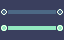

# UI

This is the section for all the UIs in the game.

## UI Visual Style

Simple, but effective. As readable as possible, while also being pleasing to look at.

## Title Screen

This is the first screen the player sees, with the games title, "Press Start/Enter", and the player character.

### Title Screen Visuals

### Title Screen Mechanics

- The player character is able to be controlled on the "Press Start/Enter" prompt, allowing players to test the character controls before playing.
- Once Start/Enter is pressed, the "Press Start/Enter" prompt fades out, the player character is no longer able to be controlled, and a box with the selections grow in the middle.
- Once the selections grow all the way, control is turned to the selections.
- After a couple seconds (10) of inactivity, the box shrinks back, and the "Press Start/Enter" prompt shows again.
- After a couple seconds again of inactivity (20s), the intro cutscene plays. This can be undone by pressing any button and takes the player back to the title screen with the "Press Start/Enter" prompt.

### Start/Continue Game

If there is no save file upon loading the game, say "Start" else say "Continue"
Load the save file, overworld room, and put the player back at their last save point.
Show a screen that shows the Save Point's location, Time played, and a small screen shot of the surrounding area of the Save Point.

### Options Menu

Load [Options](#options) menu.

### Title Screen Delete Save

Show the prompt: "Are you sure you want to delete your save data? This cannot be undone!!"

- Confirmation input is not taken afterwards for about 2 seconds, then put the selection on "No" first. But the player can press the Cancel button at any time to go back.

### Quit

Prompt: "Are you sure you want to quit?"

- Player can immediately press confirmation button to quit the game instantly.

## Gameplay UI

### HUD

This is displayed at any time the player is in control of the player character.
It turns transparent any time the player goes near the HUD to allow the player to see whats behind it.

#### Health Bar

Shows the current [Health](#health) of the player in hearts. (1 heart = 2 health)

Location: Top left

- 8 hearts for 2 rows.

#### Money Count

Shows how much [Money](#money) the player currently has.
Location: Middle top right, next to [Selected Items](#selected-items)

- New money makes the Money Count increment (or decrement) once every frame until it reaches the new value.

#### Selected Items

Shows which items the player currently has equipped.
Location: Top right

- 2 boxes with item graphics in them
- White border around one of the two boxes shows which can be quickly changed by using L/R.
  - Can switch between them with the ZL Button.

#### Custom Prompt

- Top Right: 2 Boxes that show the current [Consumable Item](#consumable-items) selected, and the current [Key Item](#key-items) selected.
- Top Left, underneath the Hearts: [Keys](#keys)
  - Only if in a dungeon, and respective to each dungeon.
  - Eg: if i get some keys from each dungeon, the corresponding keys to each dungeon only shows up when inside the respective dungeons.
  - Why? No sharing keys between dungeons.
- Bottom Left: Prompt for special controls
Prompts:

| When                            | Message (Keyboard)        | Message (Controller)      |
|---------------------------------|---------------------------|---------------------------|
| Using [Bomb Drone](#bomb-drone) | Z - Drop Bomb, X - Return | A - Drop Bomb, B - Return |
| Using [Drone](#drone)           | X - Return                | B - Return                |

### Shop UI

### Pause Screen

### Warp Screen

Shown after going into a [Drain Pipe](#drain-pipes)

Shows a simplified "transit map" of the overworld, showing each available drain pipe the player can select connecting to one another.

- The transit map looks like a dark-mode UK transit map
  - Big thick, straight lines connecting dots representing drain pipes.
  - Selected drain pipes have their paths highlighted, otherwise a darker color.

- The player can select any drain pipe, but can only get through if they are unclogged.
  - If it is clogged, it shows a short animation of the outside of the drain pipe and a small nudge of the clogged material, showing the player they cannot get through without unclogging it from the other side.

- Once one is selected, it displayed a confirmation (default: yes) to warp to the selected drain pipe.

- While selecting, the player can press the cancel button to cancel, a confirmation pops up (default: yes) to exit the menu and resume gameplay.

## Options

### Difficulty Settings

Allow Slowing: Default False
